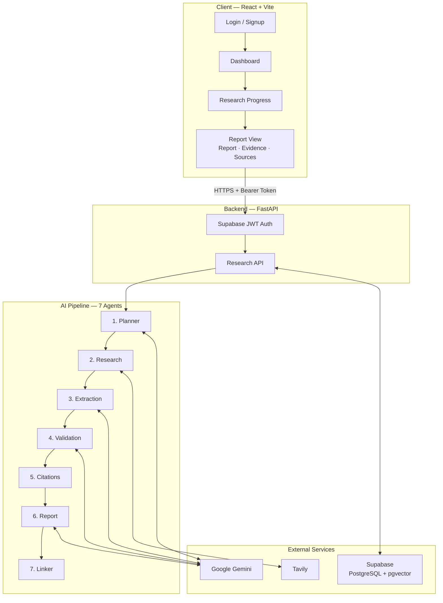
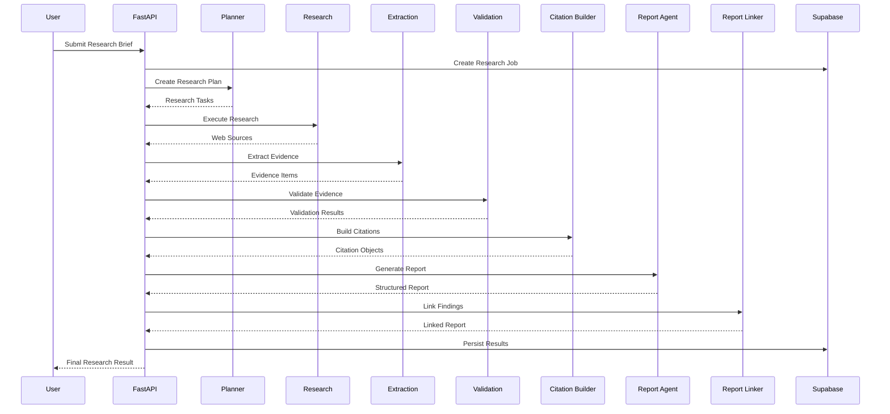
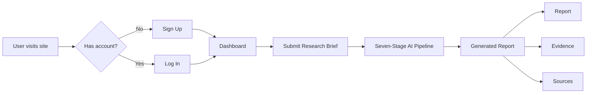

<p align="center">
  
</p>

<h1 align="center">Meridian - AI Market Research & Strategy Engine</h1>

<p align="center">
  <strong>An autonomous multi-agent system that turns a research brief into a fully cited, consulting-grade market report.</strong>
</p>

<p align="center">
  <a href="https://meridian-fronted-resarch-engine.vercel.app/">🚀 View Live Application</a>
</p>

<p align="center">
  
  
  
  
  
  
</p>

> A signed-in user submits a research brief. Seven specialized AI agents plan, search the live web, extract evidence, validate it, build citations, generate a polished report, and link findings back to their supporting sources.

---

## 📑 Table of Contents

* [Project Overview](#-project-overview)
* [Business Problem](#-business-problem)
* [Product Goal](#-product-goal)
* [Target Users](#-target-users)
* [Key Features](#-key-features)
* [System Architecture](#-system-architecture)
* [Multi-Agent Research Pipeline](#-multi-agent-research-pipeline)
* [Backend](#-backend--fastapi-service)
* [Frontend](#-frontend--react--vite-dashboard)
* [Database Schema](#-database-schema)
* [API Endpoints](#-api-endpoints)
* [End-to-End User Flow](#-end-to-end-user-flow)
* [Technology Stack](#-technology-stack)
* [Reliability & Optimization](#-reliability--optimization)
* [Evaluation & Testing](#-evaluation--testing)
* [Performance](#-performance)
* [Installation](#-installation)
* [Environment Variables](#-environment-variables)
* [Sample Research Query](#-sample-research-query)
* [Screenshots](#-screenshots)
* [Security](#-security)
* [Known Limitations](#-known-limitations)
* [Future Improvements](#-future-improvements)
* [Deployment](#-deployment)
* [Team Contributions](#-team-contributions)
* [Project Highlights](#-project-highlights)

---

# 🚀 Project Overview

**Meridian - AI Market Research & Strategy Engine** is an Applied Generative AI project designed to automate the workflow normally followed by strategy consulting and market research teams.

Instead of manually searching websites, collecting evidence, validating information, preparing citations, and writing reports, Meridian coordinates these activities through a **seven-stage AI agent pipeline**.

A user simply submits a natural-language research brief, such as:

> **"Analyze the competitive landscape of the EV battery market in Southeast Asia."**

Meridian then:

1. Breaks the research brief into structured tasks.
2. Searches the live web for relevant sources.
3. Extracts concrete evidence.
4. Validates evidence and checks reliability.
5. Builds structured citations.
6. Generates a consulting-style research report.
7. Links report findings back to supporting evidence and sources.

The final result is presented through a modern dashboard with **Report, Evidence, and Sources** views.

---

# 💼 Business Problem

Traditional market research can require significant manual effort across several stages:

* Searching multiple websites and sources
* Collecting relevant information
* Extracting useful evidence
* Checking source credibility
* Identifying conflicting information
* Organizing research findings
* Building citations
* Creating structured reports
* Connecting claims back to their supporting sources

Meridian automates this workflow using a coordinated multi-agent architecture.

Instead of manually moving between research, evidence collection, validation, citation building, and report writing, users can perform the workflow through a single research interface.

---

# 🎯 Product Goal

The goal of Meridian is to provide a **production-style AI research assistant** capable of transforming a natural-language research brief into a structured market research report while maintaining:

* Evidence traceability
* Source citations
* Evidence validation
* Structured research artifacts
* User-level data isolation
* Reliable report generation
* Transparent research workflows

The core principle is:

> **Important findings should be traceable back to the evidence and source supporting them.**

---

# 👥 Target Users

Meridian can be useful for:

* Strategy Consultants
* Business Analysts
* Market Researchers
* Product Managers
* Startup Founders
* Students and Researchers

---

# ⭐ Key Features

### 🤖 Multi-Agent AI Workflow

Seven specialized agents work together:

**Planner → Research → Extraction → Validation → Citation → Report → Linker**

Each agent has a focused responsibility within the research workflow.

### 🔎 Live Web Research

Uses **Tavily Search API** to retrieve relevant and current web sources.

### 📚 Evidence Extraction

Extracts concrete claims and supporting excerpts from retrieved sources.

### ✅ Evidence Validation

Uses Gemini to evaluate evidence for:

* Claim validity
* Source credibility
* Recency
* Duplicates
* Potential conflicts

### 🔗 Automatic Citation Building

Creates structured citation information from the collected sources.

### 📊 Consulting-Style Reports

Generates structured reports containing:

* Executive Summary
* Key Findings
* Market Signals
* Competitor Observations
* Strategic Implications
* Recommendations
* Evidence Appendix

### 🔍 Evidence-to-Report Linking

Report findings are connected to supporting evidence and citations, improving traceability.

### 🔐 Authentication & Data Isolation

Supabase Auth provides authenticated access while research jobs are scoped to their owners.

### ⚡ Reliability Features

Includes:

* Retry logic
* Exponential backoff
* Gemini fallback models
* Batch processing
* Error handling
* Fail-fast pipeline validation

---

# 🏗️ System Architecture

Meridian is divided into independently deployed frontend and backend services communicating through a REST API secured with Supabase authentication.



### Architecture Layers

| Layer           | Responsibility                                                                            |
| --------------- | ----------------------------------------------------------------------------------------- |
| **Frontend**    | React 19 SPA — authentication, research submission, progress tracking, and report viewing |
| **Backend**     | FastAPI — authentication, API routing, pipeline orchestration, and persistence            |
| **AI Pipeline** | Seven specialized agents responsible for the research workflow                            |
| **Database**    | Supabase PostgreSQL — stores research jobs and generated artifacts                        |
| **External AI** | Google Gemini for reasoning, extraction, validation, and report generation                |
| **Web Search**  | Tavily for live web research                                                              |

---

# 🧠 Multi-Agent Research Pipeline

The core orchestration is handled by:

```text
ai/pipeline/research_pipeline.py
```

Each stage receives structured information from the previous stage.



## Stage 1 — Planner Agent

**Responsibility:** Converts a raw research brief into structured research tasks.

**Input:**

```text
Natural-language research brief
```

**Output:**

* Research tasks
* Objectives
* Dependencies

---

## Stage 2 — Research Agent

**Responsibility:** Searches the live web using Tavily.

**Output:**

* Source URL
* Title
* Publisher
* Metadata

---

## Stage 3 — Evidence Extraction Agent

**Responsibility:** Extracts factual claims and supporting excerpts from sources using Gemini.

**Output:**

* Claim
* Supporting excerpt
* Entity
* Topic
* Relevance score

---

## Stage 4 — Validation Agent

**Responsibility:** Evaluates extracted evidence.

Checks:

* Claim validity
* Source credibility
* Recency
* Duplicate information
* Conflicting information

---

## Stage 5 — Citation Builder

**Responsibility:** Converts collected sources into structured citation objects.

---

## Stage 6 — Report Agent

**Responsibility:** Synthesizes validated evidence into a structured consulting-style report.

The generated report can contain:

* Executive Summary
* Key Findings
* Market Signals
* Competitor Observations
* Strategic Implications
* Recommendations
* Evidence Appendix

---

## Stage 7 — Report Linker

**Responsibility:** Connects report findings with their supporting evidence and citations.

This creates the final **evidence-linked research report**.

---

# ⚡ Fail-Fast Pipeline

Meridian is designed to fail fast rather than silently produce a low-quality report.

For example, if a stage produces:

* No research tasks
* No sources
* No evidence
* Invalid structured output
* Empty report content

the pipeline raises an error and marks the corresponding research job as failed.

This helps prevent incomplete research from being presented as a successful result.

---

# 🔌 LLM & Search Providers

### Google Gemini

Used as the reasoning engine for:

* Planning
* Evidence extraction
* Evidence validation
* Report generation

### Tavily

Used by the Research Agent for live web search.

### Mock Search

A mock search option is available for offline development and testing.

---

# ⚙️ Backend — FastAPI Service

The backend provides authentication, API routing, research orchestration, and database persistence.

### Backend Structure

```text
backend/
├── main.py
├── core/
│   ├── config.py
│   ├── auth.py
│   ├── errors.py
│   └── logging.py
├── middleware/
│   └── request_id.py
├── api/
│   ├── research.py
│   ├── reports.py
│   └── evidence.py
├── repositories/
├── services/
│   └── research_service.py
└── db/
    ├── supabase_client.py
    └── migrations/
```

### Authentication & Authorization

Protected routes use the authenticated Supabase session.

The process is:

1. Frontend sends a Supabase access token.
2. Backend verifies the token server-side.
3. The authenticated user is injected into the API route.
4. Invalid authentication returns `401`.
5. Job-specific routes verify research-job ownership.

This provides user-level access control for research jobs and their associated artifacts.

---

# 🎨 Frontend — React + Vite Dashboard

The frontend provides the user interface for authentication, research submission, progress tracking, and report exploration.

### Frontend Structure

```text
src/
├── App.jsx
├── main.jsx
├── context/
│   ├── AuthContext.jsx
│   └── ThemeContext.jsx
├── components/
│   ├── ProtectedRoute.jsx
│   ├── AuthLayout.jsx
│   ├── Shell.jsx
│   ├── StatusBadge.jsx
│   └── Footer.jsx
├── pages/
│   ├── Login.jsx
│   ├── Signup.jsx
│   ├── Dashboard.jsx
│   ├── ResearchProgress.jsx
│   ├── ReportView.jsx
│   ├── Methodology.jsx
│   └── AboutProject.jsx
├── api/
│   └── client.js
└── lib/
    └── supabaseClient.js
```

### Routing

| Route              | Page              | Access    |
| ------------------ | ----------------- | --------- |
| `/login`           | Login             | Public    |
| `/signup`          | Signup            | Public    |
| `/`                | Dashboard         | Protected |
| `/research/new`    | Research Progress | Protected |
| `/research/:jobId` | Report View       | Protected |
| `/methodology`     | Methodology       | Protected |
| `/about`           | About Project     | Protected |

### Design System

The interface follows a **navy-and-gold consulting-style visual system**.

| Concern   | Technology                              |
| --------- | --------------------------------------- |
| Styling   | Tailwind CSS v4                         |
| Animation | Framer Motion                           |
| Icons     | Lucide React, React Icons, Font Awesome |

---

# 🗄️ Database Schema

Meridian uses **Supabase PostgreSQL** to persist research artifacts.

| Table                | Purpose                               |
| -------------------- | ------------------------------------- |
| `research_jobs`      | Stores research requests              |
| `planner_tasks`      | Stores planner-generated tasks        |
| `sources`            | Stores retrieved web sources          |
| `evidence`           | Stores extracted evidence             |
| `validation_records` | Stores validation results             |
| `reports`            | Stores generated reports              |
| `feedback`           | Stores user feedback                  |
| `memory_records`     | Foundation for future semantic memory |

The database also includes **pgvector support** for future semantic retrieval and memory capabilities.

---

# 🔗 API Endpoints

| Method | Endpoint                             | Purpose                     |
| ------ | ------------------------------------ | --------------------------- |
| `GET`  | `/`                                  | Service metadata / liveness |
| `GET`  | `/health`                            | Health check                |
| `GET`  | `/api/research/`                     | List user's research jobs   |
| `POST` | `/api/research/`                     | Start a research job        |
| `GET`  | `/api/research/{job_id}`             | Fetch research job          |
| `GET`  | `/api/research/{job_id}/tasks`       | Fetch research tasks        |
| `GET`  | `/api/research/{job_id}/sources`     | Fetch sources               |
| `GET`  | `/api/research/{job_id}/evidence`    | Fetch evidence              |
| `GET`  | `/api/research/{job_id}/validations` | Fetch validation results    |
| `GET`  | `/api/research/{job_id}/report`      | Fetch final report          |

---

# 🔄 End-to-End User Flow



### Workflow

1. User signs up or logs in.
2. User reaches the dashboard.
3. User submits a research brief.
4. Research Progress displays the seven-stage workflow.
5. Backend executes the AI pipeline.
6. Intermediate artifacts are stored in Supabase.
7. The final report is generated.
8. User can explore Report, Evidence, and Sources.

---

# 🛠️ Technology Stack

| Layer               | Technology            |
| ------------------- | --------------------- |
| Frontend            | React 19 + Vite       |
| Styling             | Tailwind CSS v4       |
| Animation           | Framer Motion         |
| Routing             | React Router          |
| Authentication      | Supabase Auth         |
| Backend             | FastAPI               |
| Server              | Uvicorn               |
| Language            | Python                |
| Configuration       | Pydantic Settings     |
| Database            | Supabase + PostgreSQL |
| Vector Storage      | pgvector              |
| LLM                 | Google Gemini         |
| Web Search          | Tavily                |
| Frontend Deployment | Vercel                |
| Backend Deployment  | Render                |

---

# 🛡️ Reliability & Optimization

Meridian includes several production-oriented reliability features.

## Retry Logic

Gemini requests can be retried when temporary failures occur.

Retry sequence:

```text
2s → 4s → 8s
```

## Fallback Models

A fallback Gemini model can be used when the primary model fails.

## Batch Processing

Evidence extraction and validation can be processed in batches to:

* Reduce API calls
* Lower token consumption
* Improve execution time

## Error Handling

The pipeline handles scenarios such as:

* Gemini quota errors
* Temporary service failures
* Invalid JSON responses
* Missing evidence
* Empty report generation

---

# 🧪 Evaluation & Testing

Important parts of the system were tested throughout development.

### Tested Components

* Planner Agent
* Gemini connection
* Planner output validation
* Dependency validation
* Research pipeline
* Evidence extraction
* Evidence validation
* Citation building
* Report generation
* Report linking
* Supabase persistence
* Authentication flow

### Pipeline Validation

A successful research execution follows:

```text
Research Brief
      ↓
Planner
      ↓
Research
      ↓
Evidence Extraction
      ↓
Validation
      ↓
Citation Building
      ↓
Report Generation
      ↓
Report Linking
      ↓
Final Report
```

---

# ⏱️ Performance

Research execution time depends on query complexity, number of research tasks, external API response times, and whether retries are required.

| Scenario              | Expected Time  |
| --------------------- | -------------- |
| Best Case             | 45–70 seconds  |
| Average Case          | 70–120 seconds |
| Retry-heavy Execution | 2–4 minutes    |

These timings depend on external services such as Gemini and Tavily.

---

# 💻 Installation

## Prerequisites

Install:

* Git
* Node.js 18+
* Python 3.11+

## 1. Clone the Repository

```bash
git clone https://github.com/adityatygi/Meridian---AI-Market-Research-Strategy-Engine.git
cd Meridian---AI-Market-Research-Strategy-Engine
```

## 2. Create Python Environment

```bash
python -m venv .venv
```

### Windows

```bash
.venv\Scripts\activate
```

### macOS / Linux

```bash
source .venv/bin/activate
```

## 3. Install Backend Dependencies

```bash
pip install -r backend/requirements.txt
```

## 4. Start Backend

```bash
uvicorn backend.main:app --reload --port 8000
```

Backend:

```text
http://localhost:8000
```

Swagger documentation:

```text
http://localhost:8000/docs
```

## 5. Start Frontend

```bash
cd frontend/vite-project
npm install
npm run dev
```

Frontend:

```text
http://localhost:5173
```

## 6. Verify

1. Open the frontend.
2. Create an account.
3. Submit a research query.
4. Confirm the research progress workflow.
5. Confirm report generation.
6. Explore Report, Evidence, and Sources.

---

# 🔐 Environment Variables

Create a `.env` file for the backend:

```env
GOOGLE_API_KEY=your_gemini_api_key
TAVILY_API_KEY=your_tavily_api_key

SUPABASE_URL=https://your-project-ref.supabase.co
SUPABASE_KEY=your_supabase_service_role_key
```

Frontend environment variables:

```env
VITE_SUPABASE_URL=https://your-project-ref.supabase.co
VITE_SUPABASE_ANON_KEY=your_supabase_anon_key
VITE_API_BASE_URL=http://localhost:8000
```

> ⚠️ Never expose the Supabase service-role key in the frontend or commit it to GitHub.

---

# 🔎 Sample Research Query

```text
Student placement rate and career outcomes at AlmaBetter compared to other edtech platforms in India.
```

Another example:

```text
Analyze the competitive landscape of the EV battery market in Southeast Asia.
```

### Expected Output

The pipeline produces:

* Research Tasks
* Web Sources
* Extracted Evidence
* Validation Results
* Citations
* Executive Summary
* Key Findings
* Strategic Implications
* Recommendations
* Linked Evidence

---

# 📸 Screenshots

## Sign In Page

A secure authentication portal for accessing the Meridian research workspace.


---

## Dashboard & Dark Mode

A consulting-style workspace with a navy-and-gold interface designed for research workflows.


---

## Research Progress

Seven specialized AI agents plan, search, extract, validate, cite, and generate the report.


---

## Report View

The final report connects findings with supporting evidence and sources.


---

# 🔒 Security

Meridian implements several security measures:

| Safeguard                      | Description                                                                       |
| ------------------------------ | --------------------------------------------------------------------------------- |
| **Two-tier Supabase keys**     | Frontend uses the public anon key while the service-role key remains backend-only |
| **Server-side authentication** | Backend verifies bearer tokens                                                    |
| **Per-user data isolation**    | Users can access only their own research jobs                                     |
| **Protected routes**           | Authenticated application pages require login                                     |
| **Restricted CORS**            | Approved frontend origins can be configured                                       |

---

# ⚠️ Known Limitations

* Depends on external Gemini API availability.
* Free-tier Gemini quota limitations may trigger retries.
* Research quality depends on retrieved web sources.
* Large research topics can increase execution time.
* Web search results may vary between executions.
* The current memory system provides a foundation for future semantic recall rather than a complete long-term RAG system.

---

# 🚀 Future Improvements

Planned improvements include:

* Vector Memory Retrieval
* RAG-based Knowledge Store
* PDF Upload Research
* Multi-LLM Routing
* Streaming Report Generation
* Report Export to PDF
* Report Export to DOCX
* Advanced Research Memory
* Larger Evaluation Datasets
* Additional Research Source Integrations

---

# 🌐 Deployment

Meridian is designed as an independently deployed frontend and backend application.

| Service      | Deployment |
| ------------ | ---------- |
| **Frontend** | Vercel     |
| **Backend**  | Render     |
| **Database** | Supabase   |

### 🚀 Live Application

**[Open Meridian](https://meridian-fronted-resarch-engine.vercel.app/)**

---

# 👨‍💻 Team Contributions

This project was developed collaboratively.

| Member               | Role / Contribution                            |
| -------------------- | ---------------------------------------------- |
| **Aryan Roy (GR)**   | Frontend & UX/UI                               |
| **Deepak Chauhan**   | Authentication & API Communication             |
| **Vikram Kumar R.**  | Backend & API Layer                            |
| **Prajwal Girade**   | AI Agents 1–3: Planning, Research & Extraction |
| **Priyanshu Singh**  | AI Agents 4–5: Validation & Citation           |
| **Aditya Tyagi**     | AI Agents 6–7: Report & Linker                 |
| **Shashank Meshram** | Database & Persistence                         |

All contributors participated in development, testing, documentation, and refinement of the project.

---

# 🏆 Project Highlights

* End-to-end Applied Generative AI product
* Seven-agent AI research architecture
* Automated market research workflow
* Live web research using Tavily
* Evidence-grounded report generation
* Evidence-to-report traceability
* Structured research artifacts
* Supabase authentication and persistence
* FastAPI backend
* React-based frontend
* Gemini-powered reasoning
* Retry and fallback mechanisms
* Batch processing
* Validation and fail-fast pipeline design
* Production-style deployment

---

## 📌 Project Status

**Deployed — End-to-End Applied GenAI Application**

Meridian combines authentication, live web research, evidence extraction, validation, citation building, report generation, and evidence-linked reporting into a single AI-powered market research workflow.

---

<p align="center">

### Built as part of an Applied Generative AI Project

**React · FastAPI · Supabase · PostgreSQL · Tavily · Google Gemini**

</p>
