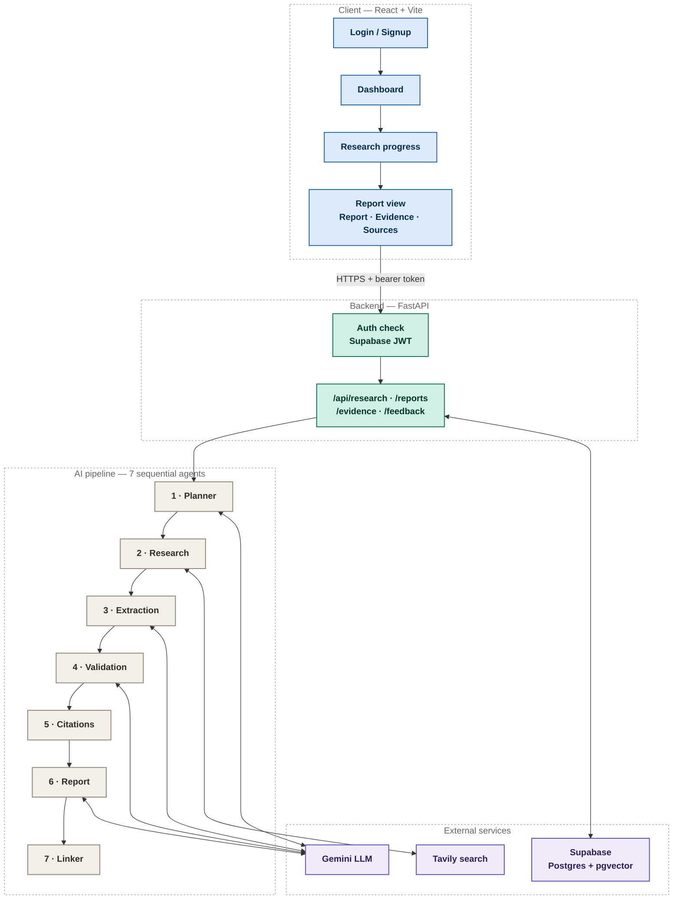
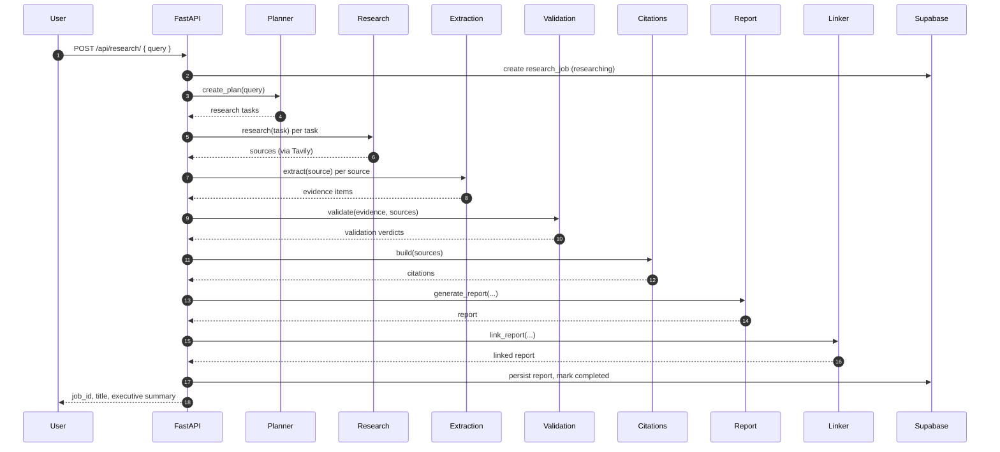
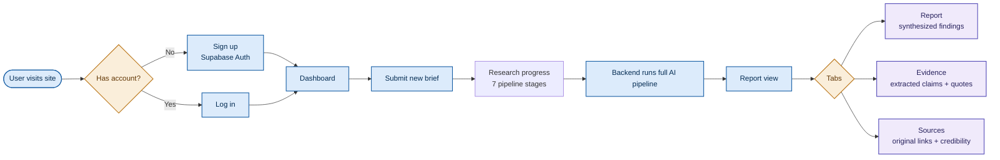

<div align="center">


# Meridian - AI Market Research & Strategy Engine

### 🚀 View Live Application

**https://meridian-fronted-resarch-engine.vercel.app/**

### An autonomous multi-agent system that turns a research brief into a fully cited, consulting-grade market report

<br/>


<br/><br/>


</div>

<br/>

> A signed-in user submits a research brief. Seven specialized AI agents plan, search the live web, extract evidence, validate it, build citations, generate a polished report, and link every finding back to its supporting source.

<br/>

## Table of Contents

* [What This Project Is](#what-this-project-is)
* [Business Problem](#business-problem)
* [Product Goal](#product-goal)
* [Highlights](#highlights)
* [System Architecture](#system-architecture)
* [The Multi-Agent Research Pipeline](#the-multi-agent-research-pipeline)
* [Backend — FastAPI Service](#backend--fastapi-service)
* [Frontend — React + Vite Dashboard](#frontend--react--vite-dashboard)
* [End-to-End User Flow](#end-to-end-user-flow)
* [Tech Stack](#tech-stack)
* [Getting the Project Running Locally](#getting-the-project-running-locally)
* [Security Notes](#security-notes)
* [Reliability & Optimization](#reliability--optimization)
* [Project Status](#project-status)
* [Deployment](#deployment)
* [Screenshots](#screenshots)
* [Project Highlights](#project-highlights)
* [Contributors](#contributors-)

<br/>

## What This Project Is

This project is an AI-powered market research analyst. A signed-in user submits a research brief — for example *"Analyze the competitive landscape of the EV battery market in Southeast Asia"* — and behind the scenes a pipeline of seven specialized AI agents works in sequence to:

| Step | What happens                                                                  |
| :--: | ----------------------------------------------------------------------------- |
|   1  | Break the brief into a structured, searchable research plan                   |
|   2  | Search the live web for relevant sources                                      |
|   3  | Extract concrete, quotable evidence from each source                          |
|   4  | Cross-check that evidence for reliability                                     |
|   5  | Build citations from validated sources                                        |
|   6  | Turn validated evidence into a polished, structured report                    |
|   7  | Attach report findings back to their supporting evidence and original sources |

The result is served through a McKinsey-styled web dashboard, where the user watches the pipeline progress through the seven stages and then reads the final report through a **Report / Evidence / Sources** tabbed view — every key finding traceable back to a live web source.

<br/>

## Business Problem

Traditional market research can require significant manual effort across multiple stages:

* Searching multiple websites and information sources
* Identifying relevant information from large amounts of content
* Extracting useful evidence and supporting claims
* Validating the reliability and relevance of information
* Organizing findings into a structured report
* Maintaining a clear citation trail for important claims

Meridian automates this workflow through a multi-agent AI pipeline while keeping the research process evidence-grounded and traceable.

<br/>

## Product Goal

The goal of Meridian is to provide an AI-powered research assistant that transforms a natural-language research brief into a structured, evidence-grounded market research report.

The system combines:

* Multi-agent AI reasoning
* Live web research
* Evidence extraction
* Evidence validation
* Citation generation
* Structured report generation
* Evidence-to-report traceability
* Secure user authentication
* Persistent research data storage

<br/>

## Highlights

<table>
<tr>
<td width="33%" valign="top">

**Multi-agent pipeline**

Seven purpose-built agents → Planner, Research, Extraction, Validation, Citation, Report, Linker. Each has one focused responsibility and is chained into a single research workflow.

</td>
<td width="33%" valign="top">

**Real authentication**

Full Supabase Auth with server-verified JWTs, not a demo gate. Every research job is scoped to its owner and enforced at the API layer.

</td>
<td width="33%" valign="top">

**Full traceability**

Every key finding in the final report links back to the evidence and web source that supports it. The user can move from the final narrative to the underlying evidence and sources.

</td>
</tr>
</table>

<br/>

## System Architecture

The project is split into two independently deployed halves that communicate over a REST API secured with Supabase Auth.



| Layer        | Responsibility                                                                                                                           |
| ------------ | ---------------------------------------------------------------------------------------------------------------------------------------- |
| **Frontend** | React 19 SPA (Vite) — authentication, brief submission, an animated progress screen, and a tabbed report viewer.                         |
| **Backend**  | FastAPI service — enforces authentication, orchestrates the AI pipeline per request, and persists intermediate research artifacts.       |
| **Database** | Supabase (managed Postgres) — structured relational storage, plus a `pgvector`-backed `memory_records` table for future semantic recall. |

<br/>

## The Multi-Agent Research Pipeline

The heart of the project is `ai/pipeline/research_pipeline.py`, which orchestrates seven sequential stages. Each stage has a single, focused responsibility and hands a typed data structure to the next.



| Stage                    | Module                              | Responsibility                                                                                                                           |
| ------------------------ | ----------------------------------- | ---------------------------------------------------------------------------------------------------------------------------------------- |
| **1. Planning**          | `ai/planner/planner_agent.py`       | Decomposes the raw research brief into a list of discrete, searchable `ResearchTask`s.                                                   |
| **2. Research**          | `ai/research/research_agent.py`     | Executes a live web search per task (via Tavily) and returns candidate `Source`s.                                                        |
| **3. Extraction**        | `ai/extraction/extraction_agent.py` | Reads each source and pulls out concrete, quotable `Evidence` (claim + supporting quote).                                                |
| **4. Validation**        | `ai/validation/validation_agent.py` | Cross-checks each piece of evidence against its source and assigns a confidence verdict.                                                 |
| **5. Citation Building** | `ai/report/citation_builder.py`     | Converts raw sources into properly formatted citation objects.                                                                           |
| **6. Report Generation** | `ai/report/report_agent.py`         | Synthesizes validated evidence into a structured `Report` containing the title, executive summary, key findings, and strategic insights. |
| **7. Report Linking**    | `ai/report/report_linker.py`        | Links report findings to their supporting evidence and citations — powering the Evidence / Sources tabs.                                 |

> **Fail-fast by design.** If any stage returns an empty result (no tasks, no sources, no evidence...), the pipeline raises immediately instead of silently producing a hollow report, and the job is marked `failed`.

### LLM & Search Providers

* **Gemini** (`google-genai`) — the reasoning engine behind the Planner, Extraction, Validation, and Report agents (`ai/llm/gemini.py`).
* **Tavily** — the live web search provider used by the Research agent (`ai/browser/tavily_search.py`), with a `mock_search.py` fallback for offline development.

<br/>

## Backend — FastAPI Service

**Location:** `Backend McKinsey/mckinsey-research-engine/`

<details>
<summary><b>Backend folder structure</b></summary>

```text
backend/
├── main.py
├── core/
│   ├── config.py
│   ├── auth.py
│   ├── errors.py
│   └── logging.py
├── middleware/
│   └── request_id.py
├── api/
│   ├── research.py
│   ├── reports.py
│   └── evidence.py
├── repositories/
├── services/
│   └── research_service.py
└── db/
    ├── supabase_client.py
    └── migrations/
```

</details>

### Authentication & Authorization

Every protected route depends on `get_current_user` (`backend/core/auth.py`):

1. The frontend sends the Supabase session's access token as a `Bearer` token in the `Authorization` header.
2. The backend verifies the token server-side against Supabase.
3. If valid, the authenticated user is injected into the route; otherwise, a `401` is raised.
4. On job-scoped routes, an ownership check confirms that the requesting user created the job.

> No research job or report is intended to be accessible to a user who did not create it.

### API Surface

| Method | Route                                | Purpose                                      |
| :----: | ------------------------------------ | -------------------------------------------- |
|  `GET` | `/`                                  | Service metadata / liveness                  |
|  `GET` | `/health`                            | Health check                                 |
|  `GET` | `/api/research/`                     | List research jobs owned by the current user |
| `POST` | `/api/research/`                     | Submit a new research brief                  |
|  `GET` | `/api/research/{job_id}`             | Fetch job status and metadata                |
|  `GET` | `/api/research/{job_id}/tasks`       | Planner-generated research tasks             |
|  `GET` | `/api/research/{job_id}/sources`     | Sources discovered during research           |
|  `GET` | `/api/research/{job_id}/evidence`    | Extracted evidence items                     |
|  `GET` | `/api/research/{job_id}/validations` | Validation verdicts                          |
|  `GET` | `/api/research/{job_id}/report`      | Final generated report                       |

### Database Schema (Supabase / Postgres)

The database is built through ordered migrations covering research jobs, tasks, sources, evidence, validation, memory, reports, and indexes.

| Migration | Purpose                        |
| :-------: | ------------------------------ |
|   `001`   | Initial research jobs schema   |
|   `002`   | Planner tasks                  |
|   `003`   | Sources                        |
|   `004`   | Evidence                       |
|   `005`   | Validation records             |
|   `006`   | Memory / `pgvector` foundation |
|   `007`   | Reports                        |
|   `008`   | Indexes                        |

`research_jobs.created_by` references `auth.users(id)`, connecting research records to authenticated users and supporting per-user data isolation.

### Backend Environment Variables

```env
# Search / AI provider keys
GOOGLE_API_KEY=
TAVILY_API_KEY=

# Supabase project
SUPABASE_URL=https://your-project-ref.supabase.co
SUPABASE_KEY=
```

> **Never expose the Supabase service-role key to the frontend or commit it to GitHub.**

<br/>

## Frontend — React + Vite Dashboard

**Location:** `Frontend McKinsey/vite-project/`

<details>
<summary><b>Frontend folder structure</b></summary>

```text
src/
├── App.jsx
├── main.jsx
├── context/
│   ├── AuthContext.jsx
│   └── ThemeContext.jsx
├── components/
│   ├── ProtectedRoute.jsx
│   ├── AuthLayout.jsx
│   ├── Shell.jsx
│   ├── StatusBadge.jsx
│   └── Footer.jsx
├── pages/
│   ├── Login.jsx / Signup.jsx
│   ├── Dashboard.jsx
│   ├── ResearchProgress.jsx
│   ├── ReportView.jsx
│   ├── Methodology.jsx
│   └── AboutProject.jsx
├── api/
│   └── client.js
└── lib/
    └── supabaseClient.js
```

</details>

### Routing Map

| Route              | Page               |   Access  |
| ------------------ | ------------------ | :-------: |
| `/login`           | `Login`            |   Public  |
| `/signup`          | `Signup`           |   Public  |
| `/`                | `Dashboard`        | Protected |
| `/research/new`    | `ResearchProgress` | Protected |
| `/research/:jobId` | `ReportView`       | Protected |
| `/methodology`     | `Methodology`      | Protected |
| `/about`           | `AboutProject`     | Protected |
| `*`                | → redirects to `/` |     —     |

`ProtectedRoute` wraps authenticated pages and reads session state from `AuthContext`; unauthenticated visitors are redirected to `/login`.

### Design System

The UI follows a navy-and-gold "Meridian" consulting brand intended to evoke a strategy-consulting deliverable: dark navy chrome, gold accent highlights, and clean, data-forward typography.

| Concern   | Library                                |
| --------- | -------------------------------------- |
| Styling   | Tailwind CSS v4                        |
| Animation | Framer Motion                          |
| Icons     | Lucide React, React Icons, FontAwesome |

### Frontend Environment Variables

```env
VITE_SUPABASE_URL=https://your-project-ref.supabase.co
VITE_SUPABASE_ANON_KEY=paste-your-anon-public-key-here

VITE_API_BASE_URL=http://localhost:8000
```

> The frontend must only use the Supabase anon/public key. The service-role key belongs exclusively in the backend environment.

<br/>

## End-to-End User Flow



1. A new user signs up or an existing user logs in through Supabase Auth.
2. The authenticated user lands on the Dashboard.
3. The user submits a new research brief.
4. The Research Progress screen displays the seven-stage research workflow while the backend executes the pipeline.
5. The backend processes the research request and stores intermediate research artifacts in Supabase.
6. The completed report is displayed through the **Report / Evidence / Sources** tabs.

<br/>

## Tech Stack

<div align="center">

| Layer                 | Technology                                   |
| --------------------- | -------------------------------------------- |
| Frontend framework    | React 19 + Vite                              |
| Frontend styling      | Tailwind CSS v4, Framer Motion               |
| Frontend auth         | Supabase JS client (`@supabase/supabase-js`) |
| Routing               | React Router v7                              |
| Backend framework     | FastAPI (Python)                             |
| Backend server        | Uvicorn                                      |
| Config management     | Pydantic Settings                            |
| Database              | Supabase (Postgres) + `pgvector`             |
| Backend auth          | Supabase Auth                                |
| LLM provider          | Google Gemini (`google-genai`)               |
| Web search provider   | Tavily                                       |
| Deployment (frontend) | Vercel                                       |
| Deployment (backend)  | Render                                       |

</div>

<br/>

## Getting the Project Running Locally

These are the steps to take this codebase from a fresh clone to a working local instance.

### Step 1 — Prerequisites

Install:

* Git
* Node.js v18+
* Python 3.11+

### Step 2 — Set Up Supabase

1. Create a new Supabase project.
2. In the SQL editor, run the migration files in `backend/db/migrations/` in numeric order.
3. From Project Settings → API, copy:

   * Project URL
   * anon/public key for the frontend
   * service-role key for the backend only

### Step 3 — Backend Setup

```bash
cd "Backend McKinsey/mckinsey-research-engine"
python -m venv venv
```

**Windows:**

```powershell
venv\Scripts\activate
```

**macOS/Linux:**

```bash
source venv/bin/activate
```

Then install dependencies:

```bash
pip install -r backend/requirements.txt
```

Create your `.env` file and add:

```env
GOOGLE_API_KEY=your_gemini_api_key
TAVILY_API_KEY=your_tavily_api_key
SUPABASE_URL=your_supabase_url
SUPABASE_KEY=your_supabase_service_role_key
```

Start the backend:

```bash
uvicorn backend.main:app --reload --port 8000
```

The API will be available at:

```text
http://localhost:8000
```

Interactive API documentation:

```text
http://localhost:8000/docs
```

### Step 4 — Frontend Setup

Open a new terminal:

```bash
cd "Frontend McKinsey/vite-project"
npm install
```

Create the frontend `.env` file:

```env
VITE_SUPABASE_URL=your_supabase_url
VITE_SUPABASE_ANON_KEY=your_supabase_anon_key
VITE_API_BASE_URL=http://localhost:8000
```

Start the frontend:

```bash
npm run dev
```

The application will be available at:

```text
http://localhost:5173
```

### Step 5 — Verify

1. Open the frontend.
2. Create an account.
3. Submit a research brief.
4. Confirm the seven pipeline stages are displayed.
5. Confirm the completed research produces a report.
6. Verify the **Report, Evidence, and Sources** tabs.

<br/>

## Security Notes

| Safeguard                    | Description                                                                                                  |
| ---------------------------- | ------------------------------------------------------------------------------------------------------------ |
| **Two-tier Supabase keys**   | The anon/public key is used by the frontend, while the service-role key is confined to the backend.          |
| **Server-verified sessions** | The backend independently verifies bearer tokens against Supabase.                                           |
| **Per-user data isolation**  | Job ownership is enforced so users can only access their own research data.                                  |
| **Restricted CORS**          | Approved frontend origins can be allowlisted through `CORS_ORIGINS`.                                         |
| **Secret protection**        | API keys and service credentials must remain in environment variables and must never be committed to GitHub. |

<br/>

## Reliability & Optimization

Meridian includes several mechanisms designed to improve the reliability of the research pipeline.

### Retry Logic

* Temporary Gemini failures can be retried.
* Exponential backoff helps handle temporary service failures.
* Retry handling reduces the impact of transient API problems.

### Fallback Handling

The research workflow includes fallback handling for situations where the primary model or search flow encounters temporary problems.

### Evidence Validation

Extracted evidence is validated before it is used in the final report, helping reduce unsupported or unreliable claims.

### Fail-Fast Pipeline

If an essential stage produces an empty result, the pipeline stops rather than silently generating an incomplete report.

<br/>

## Project Status

<div align="center">

**This repository represents the current deployed state of the Meridian AI Market Research & Strategy Engine**, a working end-to-end multi-agent research application spanning authentication, a seven-stage AI pipeline, evidence traceability, and a polished consulting-styled UI.

<br/>


</div>

<br/>

## Deployment

| Component | Platform |
| --------- | -------- |
| Frontend  | Vercel   |
| Backend   | Render   |
| Database  | Supabase |

### 🚀 Live Application

**https://meridian-fronted-resarch-engine.vercel.app/**

<br/>

## Screenshots

### 1. Meridian Sign Up Page


### 2. Meridian Query Input


### 3. Meridian Query Processing


### 4. Meridian Output Report


<br/>

## Project Highlights

* End-to-end Applied GenAI application
* Seven-agent autonomous research pipeline
* Live web research using Tavily
* Evidence extraction and validation
* Citation-grounded report generation
* Evidence-to-report traceability
* Supabase authentication and persistent data storage
* React-based consulting-style dashboard
* FastAPI backend and REST API
* Production deployment using Vercel and Render

<br/>

## Contributors ⭐

This project was developed collaboratively by:

| Contributor      | Role / Contribution |
| ---------------- | ------------------- |
| Aditya Tyagi     | Project Development |
| Deepak Chauhan   | Project Development |
| Prajwal Girade   | Project Development |
| Shashank Meshram | Project Development |
| Vikram Kumar     | Project Development |
| Aryan Roy        | Project Development |
| Priyanshu Singh  | Project Development |

All contributors participated in the development, testing, documentation, and refinement of the project.

<br/>

<div align="center">

### Built with React, FastAPI, Supabase, Tavily Search API, and Google Gemini

**Meridian — Turning research questions into evidence-grounded strategic insights.**

</div>
