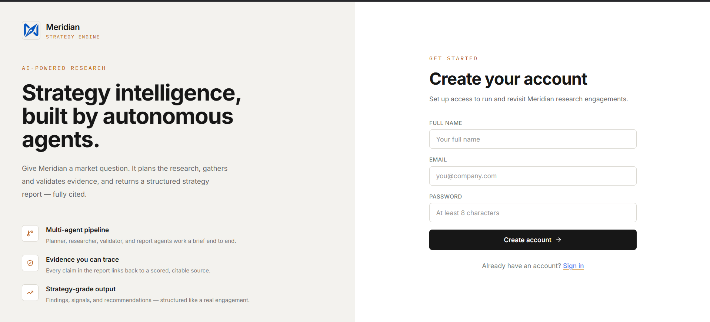
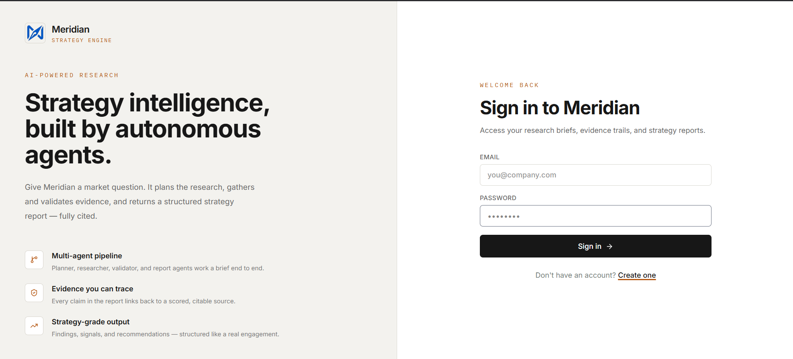
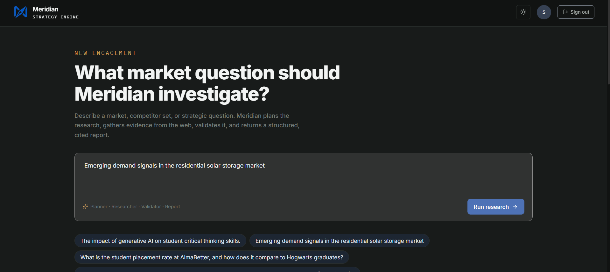
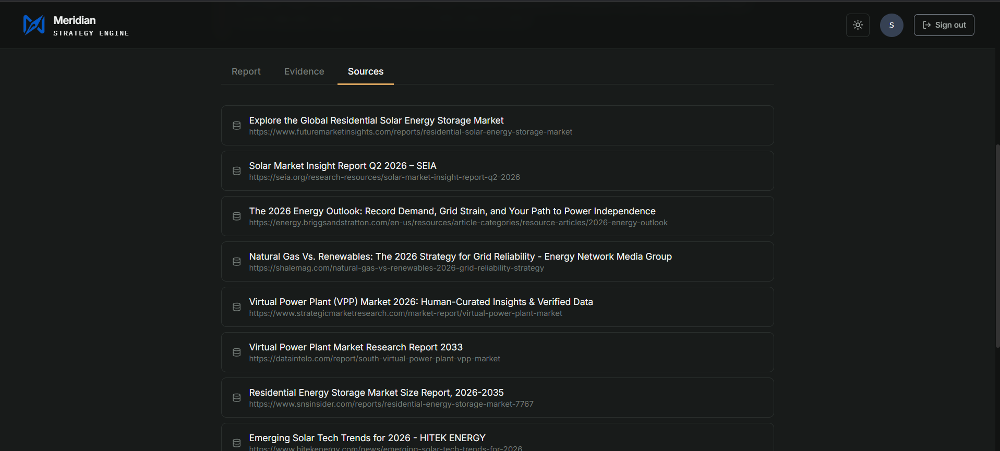
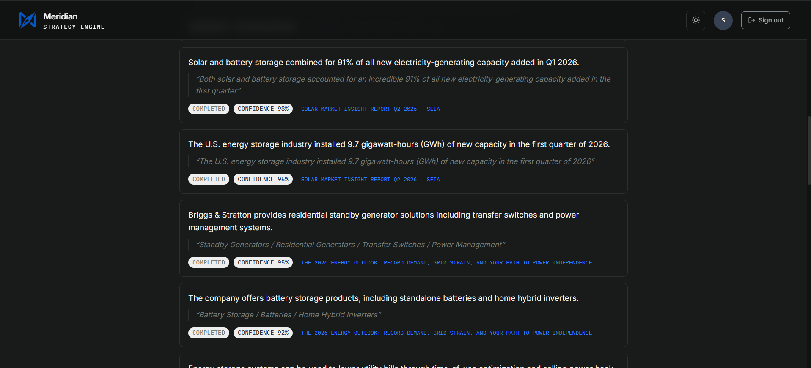
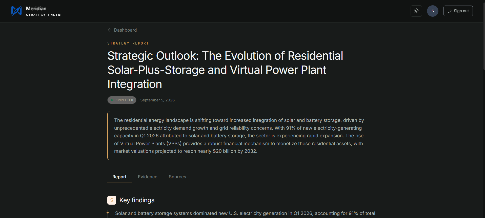
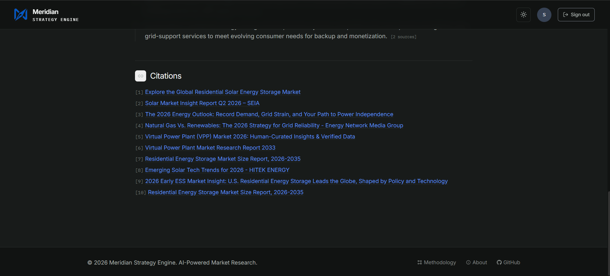

# Meridian - AI Market Research & Strategy Engine

### An autonomous multi-agent AI system that transforms a research query into a structured, evidence-backed, and fully cited market research report.

> Meridian automates the market research workflow by planning research tasks, searching the web, extracting and validating evidence, generating a structured report, and linking report findings back to their supporting sources.

---

## 📌 Table of Contents

* [Project Overview](#-project-overview)
* [Business Problem](#-business-problem)
* [Project Goal](#-project-goal)
* [Key Features](#-key-features)
* [System Architecture](#-system-architecture)
* [Multi-Agent Research Pipeline](#-multi-agent-research-pipeline)
* [Backend](#-backend)
* [Frontend](#-frontend)
* [Database](#-database)
* [Technology Stack](#-technology-stack)
* [Project Structure](#-project-structure)
* [API Endpoints](#-api-endpoints)
* [Getting Started](#-getting-started)
* [Environment Variables](#-environment-variables)
* [Sample Research Query](#-sample-research-query)
* [Screenshots](#-screenshots)
* [Documentation](#-documentation)
* [Reliability and Error Handling](#-reliability-and-error-handling)
* [Evaluation](#-evaluation)
* [Known Limitations](#-known-limitations)
* [Future Improvements](#-future-improvements)
* [Deployment](#-deployment)
* [Project Highlights](#-project-highlights)

---

# 🔎 Project Overview

Meridian is an AI-powered market research and strategy engine designed to automate the workflow normally performed by market researchers, business analysts, strategy teams, and consultants.

Instead of manually searching multiple websites, collecting information, validating evidence, preparing citations, and writing a report, Meridian uses a **multi-agent AI pipeline** to perform these stages systematically.

A user provides a natural-language research query, and Meridian processes it through specialized AI agents to produce a structured research result with supporting evidence and source traceability.

### Example

A user can submit a query such as:

> **"Analyze the impact of Generative AI on the education industry in India."**

The system then:

1. Creates a research plan.
2. Searches relevant web sources.
3. Extracts useful evidence.
4. Validates the evidence.
5. Builds citations.
6. Generates a structured report.
7. Links report findings to supporting evidence and sources.

---

# 💼 Business Problem

Traditional market research can require significant manual effort.

Researchers commonly need to:

* Search multiple websites.
* Identify relevant sources.
* Extract useful information.
* Verify evidence.
* Check source credibility and relevance.
* Organize findings.
* Prepare citations.
* Convert research into a structured report.

Meridian automates this workflow through a coordinated AI-agent architecture.

### Target Users

* Strategy Consultants
* Business Analysts
* Market Researchers
* Product Managers
* Startup Founders
* Students and Researchers

---

# 🎯 Project Goal

The goal of Meridian is to build a production-style AI research assistant that can transform a single research query into a **structured, evidence-backed, and traceable market research report**.

The system focuses on:

* Research automation
* Evidence quality
* Source traceability
* Structured reporting
* Multi-agent orchestration
* Backend and database integration

---

# ✨ Key Features

* 🤖 Multi-agent AI research workflow
* 🧠 Automated research planning
* 🌐 Live web research using Tavily
* 📑 Evidence extraction from sources
* ✅ Evidence validation
* 🔗 Citation and source linking
* 📊 Structured strategy report generation
* 🔍 Evidence-to-report traceability
* 🔐 Supabase authentication
* ⚡ FastAPI backend
* 💻 React/Vite frontend
* 🗄️ Supabase PostgreSQL database
* 🧠 Google Gemini for AI processing
* 🛡️ Error handling and retry mechanisms

---

# 🏗️ System Architecture

Meridian follows a multi-agent architecture where each agent is responsible for a specific stage of the research workflow.

```text
                         USER
                           │
                           ▼
                    Research Query
                           │
                           ▼
                    Planner Agent
                           │
                           ▼
                    Research Agent
                           │
                           ▼
                 Evidence Extraction
                           │
                           ▼
                  Validation Agent
                           │
                           ▼
                  Citation Builder
                           │
                           ▼
                     Report Agent
                           │
                           ▼
                   Report Linker
                           │
                           ▼
              Final Research Report
                           │
                           ▼
                    Supabase DB
```

### Main Components

| Component        | Responsibility                                       |
| ---------------- | ---------------------------------------------------- |
| React Frontend   | User interface and research dashboard                |
| FastAPI Backend  | API layer and orchestration                          |
| Planner Agent    | Creates structured research tasks                    |
| Research Agent   | Searches relevant web sources                        |
| Extraction Agent | Extracts useful evidence                             |
| Validation Agent | Validates extracted evidence                         |
| Citation Builder | Creates citation information                         |
| Report Agent     | Generates the final structured report                |
| Report Linker    | Connects report findings with evidence and citations |
| Supabase         | Stores application and research data                 |
| Gemini           | AI reasoning and generation                          |
| Tavily           | Web search                                           |

---

# 🤖 Multi-Agent Research Pipeline

## 1. Planner Agent

The Planner Agent converts the user's research query into smaller, structured research tasks.

### Input

Natural-language research query.

### Output

* Research tasks
* Objectives
* Dependencies
* Search requirements

---

## 2. Research Agent

The Research Agent searches the web for relevant information using the **Tavily Search API**.

It collects information such as:

* Source URL
* Source title
* Publisher
* Search metadata
* Relevant content

The purpose of this stage is to provide reliable source material for downstream agents.

---

## 3. Evidence Extraction Agent

The Extraction Agent processes the retrieved sources and identifies useful factual information.

It extracts relevant claims and supporting information using Gemini.

### Example output

* Claim
* Supporting excerpt
* Entity
* Topic
* Relevance information

---

## 4. Validation Agent

The Validation Agent evaluates extracted evidence before it is used in the final report.

It checks factors such as:

* Claim validity
* Relevance
* Source credibility
* Recency
* Duplicate information
* Conflicting information

This stage helps improve the reliability of the research output.

---

## 5. Citation Builder

The Citation Builder prepares citation information for validated sources.

This allows the final report to maintain a connection between findings and their supporting sources.

---

## 6. Report Agent

The Report Agent takes the validated research evidence and generates the structured research report.

The report can contain sections such as:

* Executive Summary
* Key Findings
* Market Signals
* Competitive Observations
* Strategic Implications
* Recommendations
* Evidence / Source Information

The Report Agent focuses on converting validated research into a readable and structured report.

---

## 7. Report Linker

The Report Linker is the final traceability stage.

It connects report findings with their corresponding:

* Evidence
* Evidence IDs
* Sources
* Citations

This makes it possible to trace a final finding back to the research evidence supporting it.

### Final Pipeline

```text
Planner
   ↓
Research
   ↓
Extraction
   ↓
Validation
   ↓
Citation Builder
   ↓
Report Agent
   ↓
Report Linker
   ↓
Final Evidence-Backed Report
```

---

# ⚙️ Backend

The backend is built using **FastAPI and Python**.

It provides APIs for:

* Creating research jobs
* Running the research workflow
* Retrieving research tasks
* Retrieving sources
* Retrieving evidence
* Retrieving validation results
* Retrieving generated reports

The backend also connects the AI pipeline with the database layer.

### Backend Layers

```text
API Layer
    ↓
Service Layer
    ↓
AI Research Pipeline
    ↓
Repository Layer
    ↓
Supabase PostgreSQL
```

### Main Repository Components

* `ResearchJobRepository`
* `PlannerTaskRepository`
* `SourceRepository`
* `EvidenceRepository`
* `ValidationRepository`
* `ReportRepository`

---

# 💻 Frontend

The frontend provides the user interface for interacting with Meridian.

It allows users to:

* Sign in / create an account
* Enter research queries
* Start research
* Monitor research progress
* View sources
* View evidence
* View validation results
* Read generated reports
* Explore citations and linked evidence

The frontend is built using **React and Vite**.

---

# 🗄️ Database

Meridian uses **Supabase PostgreSQL** for persistent data storage.

Important data areas include:

| Table / Data Area    | Purpose                                   |
| -------------------- | ----------------------------------------- |
| `research_jobs`      | Stores research requests                  |
| `planner_tasks`      | Stores generated research tasks           |
| `sources`            | Stores retrieved sources                  |
| `evidence`           | Stores extracted evidence                 |
| `validation_records` | Stores evidence validation                |
| `reports`            | Stores generated reports                  |
| `feedback`           | Stores user feedback                      |
| `memory_records`     | Foundation for future memory capabilities |

The database allows the research workflow to maintain state and preserve traceability between different pipeline stages.

---

# 🛠️ Technology Stack

## Frontend

* React
* Vite
* JavaScript
* CSS
* React Router
* Supabase Client

## Backend

* Python
* FastAPI
* Uvicorn
* Pydantic
* Python-dotenv

## AI & Search

* Google Gemini API
* Tavily Search API

## Database

* Supabase
* PostgreSQL

## Deployment

* Vercel
* Render

---

# 📁 Project Structure

The repository is organized as follows:

```text
Meridian---AI-Market-Research-Strategy-Engine/
│
├── backened/
│   ├── ai/
│   ├── backend/
│   ├── .env.example
│   ├── .gitignore
│   ├── LICENSE
│   └── README.md
│
├── frontened/
│
├── meridian-Screenshots/
│   ├── Create_account_page.png
│   ├── Dashboard (2).png
│   ├── Evidence.png
│   ├── Evidences.png
│   ├── Laded(100%).png
│   ├── Loading(25%).png
│   ├── loading(75%).png
│   ├── Part_of_report.png
│   ├── Part_of_report (2).png
│   ├── Past_Searches.png
│   ├── Query_input.png
│   ├── Report_view.png
│   ├── Sources.png
│   ├── citations.png
│   ├── sign-in_page.png
│   └── signing_up.png
│
├── project-docs/
│   ├── API.md
│   ├── ARCHITECTURE.md
│   ├── DEPLOYMENT.md
│   └── EVALUATION.md
│
├── LICENSE
└── README.md
```

> **Note:** `backened` and `frontened` are the existing repository folder names. They are intentionally kept unchanged here so the documentation matches the current repository structure.

---

# 🔌 API Endpoints

The FastAPI backend provides research-related endpoints for interacting with the research pipeline.

| Endpoint                             | Description                   |
| ------------------------------------ | ----------------------------- |
| `GET /`                              | Backend service information   |
| `GET /health`                        | Health check                  |
| `POST /research`                     | Start a research pipeline     |
| `GET /research/{job_id}/tasks`       | Retrieve planner tasks        |
| `GET /research/{job_id}/sources`     | Retrieve collected sources    |
| `GET /research/{job_id}/evidence`    | Retrieve extracted evidence   |
| `GET /research/{job_id}/validations` | Retrieve validation records   |
| `GET /research/{job_id}/report`      | Retrieve generated report     |
| `GET /docs`                          | FastAPI Swagger documentation |

For detailed API information, see:

**[`project-docs/API.md`](./project-docs/API.md)**

---

# 🚀 Getting Started

## 1. Clone the Repository

```bash
git clone https://github.com/adityatygi/Meridian---AI-Market-Research-Strategy-Engine.git
cd Meridian---AI-Market-Research-Strategy-Engine
```

---

## 2. Backend Setup

Move into the backend project directory:

```bash
cd backened
```

Create a virtual environment:

```bash
python -m venv .venv
```

### Windows

```bash
.venv\Scripts\activate
```

Install the required Python packages according to the backend requirements.

Configure the environment variables described below.

---

## 3. Run the Backend

From the backend project directory:

```bash
uvicorn backend.main:app --reload
```

The API will normally be available at:

```text
http://127.0.0.1:8000
```

Swagger API documentation:

```text
http://127.0.0.1:8000/docs
```

---

## 4. Frontend Setup

Open a new terminal and move to the frontend directory:

```bash
cd frontened
```

Install dependencies:

```bash
npm install
```

Start the development server:

```bash
npm run dev
```

The frontend will normally be available through the Vite development server.

---

# 🔐 Environment Variables

Create a local `.env` file for the required credentials.

Example:

```env
GOOGLE_API_KEY=your_gemini_api_key
TAVILY_API_KEY=your_tavily_api_key
SUPABASE_URL=your_supabase_url
SUPABASE_KEY=your_supabase_key
```

### Important

**Never commit your real `.env` file or API keys to GitHub.**

The repository contains `.env.example` as a template for required environment variables.

---

# 📝 Sample Research Query

Example:

```text
Impact of Generative AI on the education industry in India.
```

### Expected Research Output

The pipeline can produce:

* Research Tasks
* Web Sources
* Extracted Evidence
* Validation Results
* Citations
* Structured Report
* Evidence-linked Findings
* Strategic Recommendations

---

# 🖼️ Screenshots

The project screenshots are available in the [`meridian-Screenshots`](./meridian-Screenshots/) folder.

## Account Creation



## Sign In



## Dashboard


## Research Query



## Research Progress


## Sources



## Evidence



## Report



## Citations



---

# 📚 Documentation

Detailed project documentation is available in the `project-docs` directory.

### Architecture

[`ARCHITECTURE.md`](./project-docs/ARCHITECTURE.md)

Contains the system architecture, AI-agent workflow, backend structure, database integration, and traceability design.

### API Documentation

[`API.md`](./project-docs/API.md)

Contains API endpoints, request/response information, and backend service details.

### Deployment

[`DEPLOYMENT.md`](./project-docs/DEPLOYMENT.md)

Contains frontend, backend, database, and environment configuration information.

### Evaluation

[`EVALUATION.md`](./project-docs/EVALUATION.md)

Contains evaluation criteria, reliability considerations, limitations, and future improvements.

---

# 🛡️ Reliability and Error Handling

The research pipeline includes mechanisms intended to improve reliability during AI processing and external API usage.

### Retry Handling

Temporary AI or external service failures can be handled through retry mechanisms.

### Validation

Extracted evidence passes through a validation stage before being used in the final report.

### Traceability

The Report Linker maintains connections between final findings, evidence, and citations.

### External Dependency Handling

The system depends on external services such as:

* Gemini
* Tavily
* Supabase

Temporary service availability or quota issues can therefore affect execution.

---

# 🧪 Evaluation

Meridian is evaluated based on its ability to transform a research query into a structured and evidence-backed report.

### Evaluation Areas

**Research Quality**

Relevant information should be collected from appropriate sources.

**Evidence Quality**

Extracted evidence should be relevant and validated.

**Report Quality**

The final report should be structured, readable, and useful.

**Citation Traceability**

Findings should be connected to supporting evidence and sources.

**System Integration**

Frontend, backend, AI pipeline, and database components should work together.

---

# ⚠️ Known Limitations

* Research quality depends on the availability and quality of web sources.
* AI-generated content may require human review.
* External API availability can affect execution time.
* Search results may change over time.
* Large research topics may require additional processing time.
* Gemini and Tavily usage can be affected by API limits or temporary service availability.

---

# 🔮 Future Improvements

Potential future improvements include:

* Advanced source credibility scoring
* Improved long-term memory
* RAG-based knowledge retrieval
* More advanced research planning
* Multi-model AI routing
* Streaming report generation
* PDF and DOCX report export
* Enhanced monitoring and analytics
* Further frontend and UX improvements
* Production performance optimization

---

# ☁️ Deployment

Meridian uses a separated deployment architecture.

| Component  | Platform      |
| ---------- | ------------- |
| Frontend   | Vercel        |
| Backend    | Render        |
| Database   | Supabase      |
| AI Model   | Google Gemini |
| Web Search | Tavily        |

For deployment instructions, see:

**[`project-docs/DEPLOYMENT.md`](./project-docs/DEPLOYMENT.md)**

---

# 🌟 Project Highlights

* End-to-end Applied GenAI project
* Multi-agent AI architecture
* Automated market research workflow
* Evidence-backed report generation
* Source and citation traceability
* FastAPI backend
* React/Vite frontend
* Supabase PostgreSQL integration
* Gemini-powered AI processing
* Tavily-powered web research
* Validation and reliability mechanisms
* Structured project documentation

---

# 📌 Conclusion

Meridian demonstrates how a multi-agent AI architecture can automate the complete market research workflow — from a natural-language research query to a structured, evidence-backed report.

The combination of **AI agents, live web research, evidence validation, citation building, report generation, and report linking** provides a traceable research workflow designed for practical market research and strategy use cases.

---

### Built with

**React • Vite • FastAPI • Python • Google Gemini • Tavily • Supabase • PostgreSQL**

**Meridian — AI Market Research & Strategy Engine**
