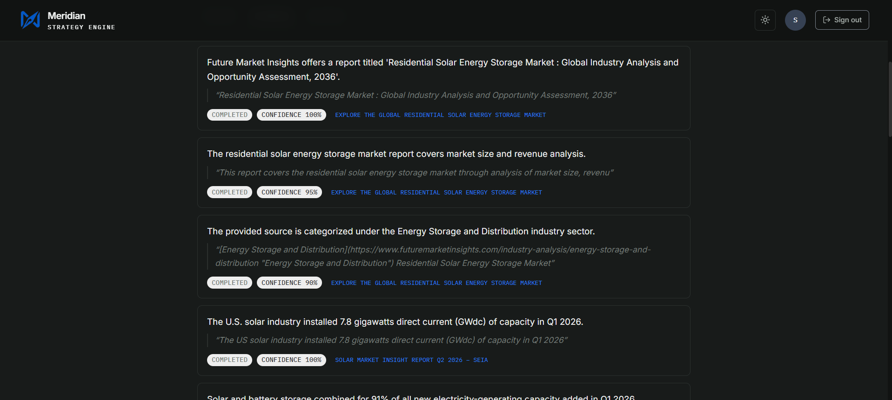
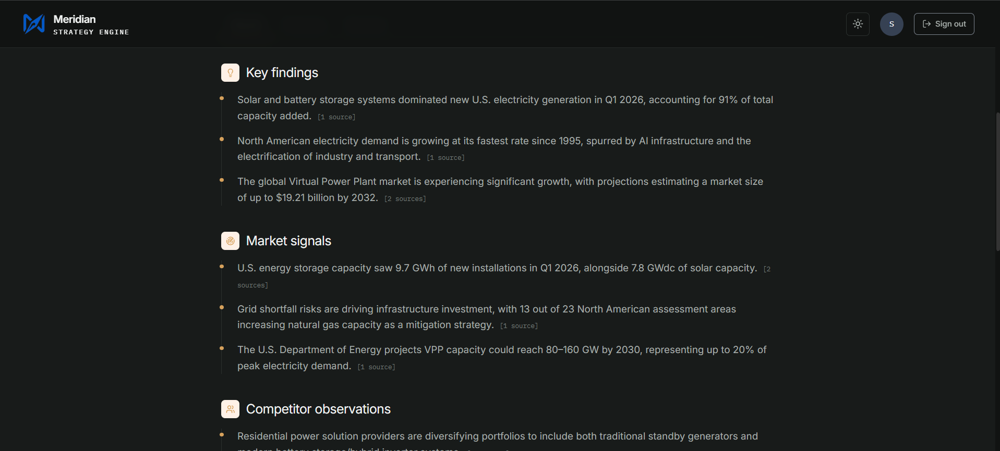

<div align="center">

# Meridian - AI Market Research & Strategy Engine

### An autonomous multi-agent system that turns a research brief into a fully cited, consulting-grade market report

<br/>


<br/><br/>


</div>

<br/>

> A signed-in user submits a research brief. Seven specialized AI agents plan, search the live web, extract evidence, validate it, and write a polished report — every finding traceable back to its original source.

<br/>

---

## What is Meridian?

**Meridian** is an AI-powered market research and strategy engine designed to automate the research process from an initial business question to a structured, evidence-backed report.

Instead of manually searching multiple websites, collecting information, checking evidence, and preparing a final report, Meridian coordinates a **multi-agent AI research pipeline** to perform these tasks systematically.

The system combines:

* Multi-agent AI research
* Live web search
* Evidence extraction
* Evidence validation
* Citation building
* Automated report generation
* Source-to-report traceability

The result is a structured research report that is easier to review, verify, and use for decision-making.

---

## Why Meridian?

Traditional market research often involves:

* Repeated web searches
* Manual information collection
* Time-consuming source comparison
* Manual evidence verification
* Creating reports from scattered information
* Difficulty tracking where individual findings came from

Meridian addresses these challenges by dividing the research workflow into specialized AI agents.

### Core Goal

> **Turn a research brief into a structured, evidence-backed and traceable market research report with minimal manual effort.**

---

## Target Users

Meridian can support:

* Strategy and consulting teams
* Market researchers
* Business analysts
* Product teams
* Startups and founders
* Students and researchers
* Decision-makers requiring evidence-backed insights

---

# Key Features

### 🤖 Multi-Agent Research Pipeline

Seven specialized agents work together to complete the research workflow.

### 🌐 Live Web Research

The Research Agent searches the web using **Tavily** to collect relevant sources.

### 📑 Evidence Extraction

Important claims and supporting information are extracted from research sources.

### ✅ Evidence Validation

Evidence is validated to improve research reliability and reduce unsupported claims.

### 🔗 Citation Traceability

The system connects report findings with their supporting sources and evidence.

### 📊 Structured Reports

The Report Agent converts validated research into a professional market research report.

### 🔍 End-to-End Traceability

Users can move from:

**Report → Finding → Evidence → Source**

This makes the research process easier to verify.

---

# System Architecture

```text
                         USER
                           │
                           ▼
                    Research Brief
                           │
                           ▼
                    ┌─────────────┐
                    │   Planner   │
                    │    Agent    │
                    └──────┬──────┘
                           │
                           ▼
                    ┌─────────────┐
                    │  Research   │
                    │    Agent    │
                    └──────┬──────┘
                           │
                           ▼
                 ┌──────────────────┐
                 │ Evidence         │
                 │ Extraction Agent │
                 └────────┬─────────┘
                          │
                          ▼
                 ┌──────────────────┐
                 │ Validation Agent │
                 └────────┬─────────┘
                          │
                          ▼
                 ┌──────────────────┐
                 │ Citation Builder │
                 └────────┬─────────┘
                          │
                          ▼
                 ┌──────────────────┐
                 │   Report Agent   │
                 └────────┬─────────┘
                          │
                          ▼
                 ┌──────────────────┐
                 │  Report Linker   │
                 └────────┬─────────┘
                          │
                          ▼
                   FINAL REPORT
```

---

# Seven-Agent Pipeline

## 1. Planner Agent

The Planner Agent converts the user's research question into smaller research tasks.

It determines what information needs to be investigated and creates a structured research plan.

---

## 2. Research Agent

The Research Agent performs live web research using **Tavily**.

It searches for relevant sources and collects information required for the planned research tasks.

---

## 3. Evidence Extraction Agent

This agent processes collected sources and extracts useful evidence and claims.

The extracted information becomes the foundation for later validation and report generation.

---

## 4. Validation Agent

The Validation Agent checks the extracted evidence for relevance and consistency.

This stage helps improve the reliability of information before it is used in the final report.

---

## 5. Citation Builder

The Citation Builder organizes supporting source information so that research findings can be connected to their original sources.

This provides the foundation for citation traceability.

---

## 6. Report Agent

The Report Agent takes the validated research and generates a structured, professional market research report.

It organizes the information into readable sections and converts research findings into useful business insights.

---

## 7. Report Linker

The Report Linker connects the final report back to its supporting evidence and citations.

This creates the final traceability chain:

```text
Report Finding
      ↓
Evidence
      ↓
Source
```

This is important because users can understand **where a particular finding came from**.

---

# Backend Architecture

Meridian uses a layered backend architecture built with **FastAPI**.

```text
API Layer
    │
    ▼
Research Service Layer
    │
    ▼
Repository Layer
    │
    ▼
Supabase PostgreSQL
```

### API Layer

Handles incoming requests and exposes REST API endpoints.

### Service Layer

Coordinates the research workflow and application logic.

### Repository Layer

Provides structured access to database entities.

### Database Layer

Supabase PostgreSQL stores research jobs, sources, evidence, validations, reports and related application data.

---

# Frontend

The frontend is built using:

* React
* Vite
* Tailwind CSS

The frontend provides the user interface for:

* Account creation
* Sign in
* Research query submission
* Research progress
* Sources
* Evidence
* Generated reports
* Citations
* Previous searches

---

# Data Layer

Meridian uses **Supabase PostgreSQL** for persistent application data.

The database includes entities such as:

* Research Jobs
* Planner Tasks
* Sources
* Evidence
* Validation Records
* Reports
* Feedback
* Memory

This allows research results and generated artifacts to be stored and retrieved systematically.

---

# AI & External Services

### Google Gemini

Used as the primary large language model for AI-powered reasoning, extraction, validation and report generation.

### Tavily

Used for live web search and source discovery.

### Supabase

Used for authentication and PostgreSQL-based persistent data storage.

### Vercel

Used for frontend deployment.

### Render

Used for backend deployment.

---

# Technology Stack

| Layer               | Technology          |
| ------------------- | ------------------- |
| Frontend            | React + Vite        |
| Styling             | Tailwind CSS        |
| Backend             | FastAPI             |
| Language            | Python              |
| AI / LLM            | Google Gemini       |
| Web Search          | Tavily              |
| Database            | Supabase PostgreSQL |
| Authentication      | Supabase            |
| Frontend Deployment | Vercel              |
| Backend Deployment  | Render              |

---

# Project Structure

```text
Meridian---AI-Market-Research-Strategy-Engine/
│
├── backened/
│   ├── ai/
│   ├── backend/
│   ├── .env.example
│   ├── .gitignore
│   ├── LICENSE
│   └── README.md
│
├── frontened/
│
├── meridian-Screenshots/
│
├── project-docs/
│   ├── API.md
│   ├── ARCHITECTURE.md
│   ├── DEPLOYMENT.md
│   └── EVALUATION.md
│
├── .env.example
├── .gitignore
├── LICENSE
└── README.md
```

> **Note:** The existing `backened` and `frontened` folder names are retained to match the current project structure.

---

# API

Meridian exposes a FastAPI REST API for creating and inspecting research jobs and retrieving generated artifacts.

### Start Research

```http
POST /research
```

Example request:

```json
{
  "query": "Impact of Generative AI on education."
}
```

### Get Research Tasks

```http
GET /research/{job_id}/tasks
```

### Get Sources

```http
GET /research/{job_id}/sources
```

### Get Evidence

```http
GET /research/{job_id}/evidence
```

### Get Validation Records

```http
GET /research/{job_id}/validations
```

### Get Final Report

```http
GET /research/{job_id}/report
```

### Swagger Documentation

```text
GET /docs
```

FastAPI Swagger UI provides an interactive way to test the backend APIs.

---

# Getting Started

## 1. Clone the Repository

```bash
git clone https://github.com/adityatygi/Meridian---AI-Market-Research-Strategy-Engine.git
cd Meridian---AI-Market-Research-Strategy-Engine
```

---

## 2. Backend Setup

Navigate to the backend directory:

```bash
cd backened
```

Create a virtual environment:

```bash
python -m venv .venv
```

Activate it on Windows:

```bash
.venv\Scripts\activate
```

Install dependencies:

```bash
pip install -r requirements.txt
```

---

## 3. Environment Configuration

Create a `.env` file inside the `backened` directory.

Required variables:

```env
GOOGLE_API_KEY=your_gemini_api_key
TAVILY_API_KEY=your_tavily_api_key
SUPABASE_URL=your_supabase_url
SUPABASE_KEY=your_supabase_service_role_key
```

### Security

Never commit the real `.env` file.

The repository includes `.env.example` files containing placeholders only.

---

## 4. Run the Backend

From the `backened` directory:

```bash
uvicorn backend.main:app --reload
```

Backend:

```text
http://127.0.0.1:8000
```

Swagger:

```text
http://127.0.0.1:8000/docs
```

---

## 5. Frontend Setup

Navigate to the frontend directory:

```bash
cd frontened
```

Install dependencies:

```bash
npm install
```

Start the development server:

```bash
npm run dev
```

The frontend will be available through the Vite development server.

---

# Example Research Query

Example:

```text
Impact of Generative AI on the education industry
```

Meridian processes the request through the complete research pipeline:

```text
Research Brief
      ↓
Planner
      ↓
Research
      ↓
Evidence Extraction
      ↓
Validation
      ↓
Citation Builder
      ↓
Report Agent
      ↓
Report Linker
      ↓
Final Report
```

---

# Product Screenshots

## Account Creation


## Sign In


## Dashboard


## Research Query


## Research Progress


## Sources


## Evidence




## Generated Report





## Citations


---

# Documentation

Additional project documentation is available in the `project-docs` directory.

* `API.md` — API endpoints and backend services
* `ARCHITECTURE.md` — System and agent architecture
* `DEPLOYMENT.md` — Frontend and backend deployment
* `EVALUATION.md` — Evaluation criteria, limitations and future improvements

---

# Reliability

Meridian includes several mechanisms intended to improve research reliability:

* Evidence extraction before report generation
* Evidence validation
* Source tracking
* Citation building
* Report-to-source linking
* Structured research planning
* Error handling and retry mechanisms
* Persistent database storage

These mechanisms help make the generated report more transparent and traceable.

---

# Evaluation Criteria

Meridian can be evaluated across the following areas:

### Research Quality

Ability to discover relevant and useful information from external sources.

### Evidence Quality

Ability to extract and validate supporting evidence.

### Report Quality

Ability to generate a structured and readable research report.

### Citation Traceability

Ability to connect report findings with their supporting evidence and original sources.

### System Integration

Ability of the frontend, backend, AI pipeline and database to operate together as an end-to-end system.

---

# Known Limitations

* Research quality depends on the availability and quality of external web sources.
* AI-generated content may require human review.
* External API availability can affect execution time.
* Search results may change over time.
* AI-generated findings should be reviewed before being used for high-impact business decisions.

---

# Future Improvements

Potential future enhancements include:

* Advanced source credibility scoring
* Improved memory capabilities
* More advanced research planning
* Better monitoring and analytics
* Production performance optimization
* Enhanced frontend and UX
* More detailed research evaluation
* Improved source ranking and verification

---

# Deployment

Meridian is deployed using:

```text
Frontend
   ↓
Vercel

Backend
   ↓
Render

Database
   ↓
Supabase

AI
   ↓
Google Gemini

Web Search
   ↓
Tavily
```

---

# Project Highlights

### End-to-End AI Research

Converts a research brief into a complete market research report.

### Multi-Agent Architecture

Seven specialized agents divide the research process into focused stages.

### Evidence-Backed Results

Research findings are supported by extracted and validated evidence.

### Citation Traceability

Findings can be traced back to their supporting sources.

### Modern Full-Stack Architecture

Combines React, FastAPI, Gemini, Tavily and Supabase.

### Deployed Application

The system is designed as an end-to-end deployed application rather than only a local prototype.

---

# Conclusion

**Meridian** demonstrates how multi-agent AI systems can automate a traditionally time-consuming market research workflow.

By combining planning, live web research, evidence extraction, validation, citation building, report generation and source linking, Meridian transforms an open-ended research question into a structured and traceable business report.

> **From research brief to evidence-backed strategy — Meridian brings the complete workflow together.**

---

<div align="center">

### Meridian — AI Market Research & Strategy Engine

**Research smarter. Validate evidence. Trace every insight.**

</div>
